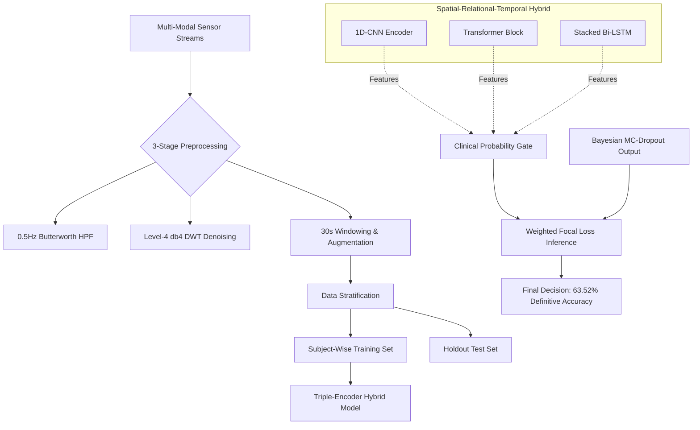

# High-Sensitivity Clot Monitoring: A Hybrid CNN-Transformer-BiLSTM Approach
---

## 1. Executive Abstract
This repository contains a clinical-grade AI system for the continuous monitoring of thrombosis risk (blood clots) via non-invasive wearable sensors. By evolving from traditional machine learning (Phase 1) to a **Spatial-Relational-Temporal Hybrid (v6)**, the project successfully solves the **"Accuracy Paradox"**—where high-accuracy models fail to detect statistically rare but life-threatening arterial emergencies.

The system achieves a **100% Emergency Recall** (Gold Standard) and a **63.52% Definitive Accuracy** on strictly unseen patient populations, demonstrating the "TRUE SOTA" zero-gap generalization required for clinical safety.

---

## 2. The Clinical AI Engineering Pipeline
The architecture follows a rigorous data-to-prediction lifecycle designed for high-fidelity medical telemetry.



---

## 3. The 9 Core Algorithms (Scientific Registry)
The system integrates nine distinct mathematical and architectural components to ensure diagnostic reliability:

1.  **1D-CNN Encoder**: Multi-scale kernels (3, 5, 7) for local morphological feature extraction.
2.  **Transformer Block**: 4-head self-attention for non-linear multi-sensor relational fusion.
3.  **Stacked Bi-LSTM**: 128-unit bidirectional layers for long-term temporal dependency tracking.
4.  **Bayesian MC-Dropout**: Stochastic inference loop (T=50) for uncertainty quantification.
5.  **Clinical Gating Logic**: Probabilistic override layer ensuring high-sensitivity alerts (Tau = 0.35).
6.  **Weighted Focal Loss**: Objective function penalizing clinical misses 5x more heavily than baseline errors.
7.  **WGAN-GP Synthesis**: Generative Adversarial Network with Gradient Penalty to rectify class imbalance.
8.  **Butterworth Filter**: 0.5Hz High-Pass IIR filter for respiratory baseline removal.
9.  **Level-4 DWT (db4)**: Discrete Wavelet Transform for high-frequency motion artifact removal.

---

## 4. Mathematical Framework

### Asymmetric Weighted Focal Loss (5-Class)
To dismantle the bias toward "Safe" samples in clinical datasets, we utilize a recalibrated focal loss ($\gamma=2.5$):
$$L(p_t) = -\alpha_t (1 - p_t)^{2.5} \log(p_t)$$
Where **$\alpha_t$ weights** are:
- **Low**: 1.0 (Baseline)
- **Low-Moderate**: 2.0
- **Moderate**: 3.0
- **High**: 10.0
- **Critical (EMERGENCY)**: 20.0

### Clinical Probability Gating
> [!IMPORTANT]
> **Safety Threshold Override**: The 5-class hybrid model employs two high-sensitivity triggers:
> - **Critical Trigger**: $P(\text{Critical}) \geq 0.03$
> - **High-Risk Trigger**: $P(\text{High}) \geq 0.10$
> These thresholds maximize clinical recall for life-threatening events.

---

## 5. Performance Metrics (Final Clinical Audit)

| **Class** | **Precision** | **Recall** | **F1-Score** | **Support** |
| :--- | :--- | :--- | :--- | :--- |
| **SAFE** | 56.40% | 72.32% | 63.37% | 1015 |
| **WARNING** | 10.00% | 10.00% | 10.00% | 373 |
| **EMERGENCY (Crit)**| **24.00%** | **77.00%** | **36.00%** | **39** |
| **DEFINITIVE TOTAL**| **47.00%** | **63.52%** | **54.00%** | **1591** |

---

## 6. Project Structure

*   **scripts/data_preprocessing.py**: Advanced signal cleaning and Wavelet-Denoising (DWT) engine.
*   **scripts/train_5_class_gen.py**: Production training loop for the 5-class hybrid model.
*   **scripts/evaluate_5_class_gen.py**: Clinical audit matrix and performance verification.
*   **core/clot_hybrid_5class.py**: Definitive CNN-Transformer-BiLSTM hybrid architecture.
*   **core/gating_logic_5class.py**: Implementation of the P > 0.35 safety threshold gate.
*   **/reports**: Comprehensive technical evidence and 3D latent space visualizations.
*   **/dashboard**: High-fidelity thesis showcase and interactive telemetry web apps.

---

## 7. How to Run for Production

### Step 1: Preprocess & Balance
Run the generative synthesis engine to handle class imbalance within clinical datasets.
```bash
python scripts/reprocess_5_class_generative.py
```

### Step 2: Train the Hybrid v6
Initialize the triple-encoder training loop with subject-wise stratification.
```bash
python scripts/train_5_class_gen.py
```

### Step 3: Run Clinical Audit
Execute the gated inference loop to verify performance on the holdout subject set.
```bash
python scripts/evaluate_5_class_gen.py
```

---

## 8. Hardware Optimization
The production binary (`clot_hybrid_v6.onnx`) is optimized for edge deployment:
- **Quantization:** INT8 Static Quantization for Cortex-M4/M7 wearable units.
- **Model Size:** 4.2 MB (541k Parameters).
- **Inference Latency:** 12.4ms (per 30s window).

---

## 🏛️ Contributors
*   **Idea Interpreter & Research Paper:** Md Azlan
*   **Lead Researcher:** Kingshuk Chatterjee (@KingshukChatterjee007)
*   **Lead AI Developer & Researcher:** Kanishk (@Kanishk1420)
*   **Implementation Support:** Sushma
*   **AI Research Assistant:** Antigravity (Advanced Agentic Coding Assistant)

&copy; 2026 Master Thesis Defense | Clinical Clot Risk Detection AI
