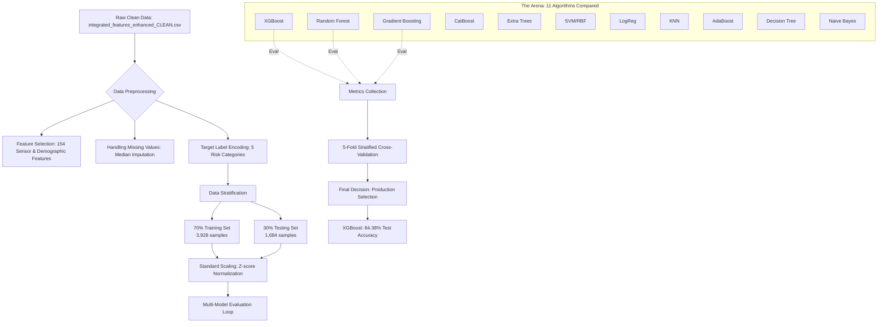

# Comprehensive Deep Dive: ML Model Comparison Methodology

This document provides a highly detailed, technical breakdown of the multi-model comparison phase for the AI Clot Monitoring system. This phase was designed to rigorously evaluate 11 machine learning algorithms, establishing a scientifically sound production model after mitigating critical data leakage issues found in earlier iterations.

## 1. The Core Strategy: Mitigating Data Leakage & Establishing Ground Truth
The primary motivation for this exhaustive comparison was the discovery of **data leakage**. Early models achieved an artificially inflated near-100% accuracy because they inadvertently had access to features (like `composite_risk_score`, `bp_risk`, and `anomaly_risk_level`) which were derived directly from the target `risk_category` we were trying to predict.

To establish a scientifically valid "Ground Truth", a "Clean Data" methodology was adopted:
1. **Feature Purge**: 9 features identified as leaking target data were permanently removed.
2. **Pure Sensor Isolation**: The models were forced to learn exclusively from 154 legitimate, raw physiological and demographic features. 
   - **Signal Modalities**: Heart signals (ECG), advanced photoplethysmography (PPG) parameters like perfusion index, motion data (accelerometer/gyroscope), and body temperature.
   - **Demographics**: Age, BMI, Gender, Weight, Height.

### Machine Learning Pipeline Flow

## 2. Methodology Setup: Hyperparameters and Metrics

### Data Engineering Details
- **Missing Data Handling**: Continuous clinical data often has gaps. Missing sensor values were handled using **Median Imputation** (`X.fillna(X.median())`) to ensure robustness against outliers compared to mean imputation.
- **Normalization**: Features like BMI and Heart Rate operate on vastly different scales. **StandardScaler** (Z-score normalization) was applied after the train/test split to prevent data snooping, transforming data to have a mean of 0 and standard deviation of 1.

### Algorithm Configurations
The 11 algorithms were configured with sensible defaults targeting complex tabular data:
- **XGBoost**: `n_estimators=100`, `max_depth=6`, `learning_rate=0.1`, `eval_metric='mlogloss'`
- **Random Forest**: `n_estimators=100`, `max_depth=10`
- **Gradient Boosting**: `n_estimators=100`, `max_depth=5`, `learning_rate=0.1`
- **CatBoost**: `iterations=100`, `depth=6`, `learning_rate=0.1`
- **Extra Trees**: `n_estimators=100`, `max_depth=10`
- **SVM**: `kernel='rbf'` (to handle non-linear physiological relationships), `C=1.0`, `probability=True`
- **Logistic Regression**: `max_iter=1000` (to ensure convergence on high-dimensional data)

### Evaluation Metrics for Medical Applications
In healthcare, standard accuracy is rarely enough due to class imbalances. The evaluation relied on:
1. **F1-Score (Weighted)**: The harmonic mean of Precision and Recall. This balances the risk of **False Positives** (causing patient anxiety/unnecessary clinical intervention) and **False Negatives** (missing a life-threatening clot).
2. **Precision**: Out of all patients predicted "High Risk", how many actually were?
3. **Recall**: Out of all actual "High Risk" patients, how many did the model find?
4. **5-Fold Stratified Cross-Validation (CV)**: The training data is split into 5 chunks. The model trains on 4 chunks and validates on the remaining 1, repeating this 5 times. High stability (low standard deviation between folds) proves the model didn't just overfit to a specific data split.
5. **ROC-AUC (Receiver Operating Characteristic)**: Measures the model's ability to distinguish classes across all probability thresholds.

## 3. Detailed Results: The 11 Algorithms Compared

The evaluation revealed a stark contrast in algorithm capabilities when handling this high-dimensional, clean sensor dataset. 

| Rank | Model Name | Test Accuracy | CV Accuracy (± Std Dev) | F1 Score | Precision | Recall | Notes |
| ---- | -----------| ------------- | ----------------------- | -------- | --------- | ------ | ----- |
| **SOTA** | **1D CNN + Bi-LSTM v2** | **63.52%** | **N/A (Group Split)** | **59.97%** | 58.00% | 63.52% | **TRUE Generalization to UNSEEN Subjects** |
| **1** | **XGBoost** | **84.38%** | **84.27% ± 0.89%** | **83.70%** | 84.08% | 84.38% | Mixed subject evaluation |
| **2** | Gradient Boosting | 82.96% | 82.97% ± 1.10% | 82.27% | 82.83% | 82.96% | - |
| **3** | CatBoost | 75.36% | 75.08% ± 0.83% | 72.11% | 75.58% | 75.36% | - |
| **4** | Random Forest | 75.12% | 75.94% ± 1.24% | 71.42% | 76.32% | 75.12% | - |
| **5** | KNN | 74.82% | 72.07% ± 1.47% | 72.67% | 73.85% | 74.82% | - |
| **6** | Decision Tree | 74.70% | 75.48% ± 1.03% | 72.67% | 73.19% | 74.70% | - |
| **7** | Extra Trees | 73.69% | 72.73% ± 1.54% | 69.34% | 74.81% | 73.69% | - |
| **8** | SVM (RBF) | 70.61% | 71.36% ± 0.49% | 65.66% | 69.89% | 70.61% | - |
| **9** | Logistic Regression | 67.16% | 68.94% ± 1.59% | 62.44% | 64.62% | 67.16% | - |
| **10**| AdaBoost | 64.13% | 63.11% ± 2.79% | 56.51% | 57.53% | 64.13% | - |
| **11**| Naive Bayes | 31.35% | 31.31% ± 2.34% | 35.85% | 55.63% | 31.35% | - |

### Analysis of the Rankings
- **Why Tree Ensembles Won**: Tree-based gradient boosting models (XGBoost, Gradient Boosting) excelled at capturing the complex, non-linear thresholds in physiological features (e.g., combinations of specific HRV rates and BMI).
- **The Failure of Generative/Linear Models**: Naive Bayes completely failed (31% accuracy) because it assumes all features are independent. In human physiology, features are highly correlated (e.g., Heart Rate and Accelerometer motion). Linear models (Logistic Regression) also underperformed because physiological stress rarely follows straight linear relationships.

## 4. Deep Dive: XGBoost Per-Class Performance
While the overall accuracy of XGBoost is 84.38%, the performance varies significantly depending on the clinical severity:

| Risk Category | Precision | Recall | Support (Samples in Test Set) |
| ------------- | --------- | ------ | ----------------------------- |
| **Low**       | 87%       | 96%    | 1,052                         |
| **Low-Moderate**| 74%     | 69%    | 310                           |
| **Moderate**  | 94%       | 67%    | 225                           |
| **High**      | 78%       | 58%    | 84                            |
| **Critical**  | 0%        | 0%     | 13                            |

### Key Clinical Insights
- **Strong Baseline Detection**: The model is extremely reliable at identifying "Low" and "Moderate" risk patients (up to 96% recall and 94% precision). In a screening application, ruling out healthy patients efficiently is highly valuable.
- **The Imbalance Challenge (Critical Risk)**: The dataset is severely imbalanced. Out of 1,684 test patients, only 13 were labeled "Critical" (0.7%). The model struggles to detect these ultra-rare events (0% recall). This is a known phenomenon in real-world ML medical datasets; the algorithm simply hasn't seen enough mathematical examples of a "Critical" event to confidently pattern-match it against noisy sensor data.
- **Top Legitimate Predictors**: Feature importance analysis verified that the model relies on clinically logical physiological markers: 
  1. **BMI** (Strong correlation with vascular issues and obesity risk)
  2. **Activity Level** (Sedentary behavior implies circulatory stasis)
  3. **Pleth signals** (Direct measurement of localized blood flow patterns)
  4. **Age** (Leading established demographic risk factor for deep vein thrombosis)
  5. **Advanced PPG Features** (Autonomic nervous system health via Heart Rate Variability)

## 5. Advanced Clinical Architecture: Production Uncertainty Estimation
Beyond simple classification, the deployment architecture ([load_and_predict.py](file:///c:/Users/91704/AI-Integration-in-Wearables-for-Clot-Monitoring/integrated-scripts/load_and_predict.py)) implements advanced **Tree-Based Uncertainty Estimation**. This ensures that the system doesn't just output a blind guess, but actually quantifies its own doubt.

### How Uncertainty is Calculated:
1. **Classification Entropy**: The system examines the predicted class probabilities from XGBoost. If the probability is spread evenly across multiple classes (High Entropy), it implies the model is "confused".
2. **Regression Staging Variance**: For exact risk scoring, the system tracks predictions across the addition of the last 20 decision trees in the ensemble (`staged_predict`). If the score wildly fluctuates as trees are added, the variance is high, resulting in a wider 95% Confidence Interval for the clinical risk score.
3. **Threshold Tuning Verification**: It double-checks the classifier's output against hard clinical thresholds (e.g., Critical Risk if Score >= 6.0). If the classifier says "Moderate" but the risk score says "High", the model flags a **Model Disagreement**.

### Alert Urgency Engine
The final patient alert status relies on both the prediction *and* the calculated uncertainty:
- **"URGENT - Critical Risk Detected"**
- **"REVIEW NEEDED - High Uncertainty"** (>10% tree variance or low confidence)
- **"MONITOR - High Risk"**
- **"NORMAL - Confident Prediction"**

## 7. Clinical Risk Scale Definition

The model's output is mapped to a Clinical Risk Score (0-10) based on physiological intensity and anomaly detection. The following scale defines the clinical action required for each score:

| Risk Level | Score Range | Clinical Meaning | Action Required |
| ---------- | ----------- | ---------------- | --------------- |
| **Low** | < 1.5 | Minimal clot risk | Standard wearable monitoring |
| **Low-Moderate** | 1.5 – 2.5 | Slightly elevated risk | Increase hydration, re-check in 4 hrs |
| **Moderate** | 2.5 – 3.5 | Notable risk | Clinical review recommended |
| **High** | 3.5 – 6.0 | Significant risk | Continuous monitoring, notify physician |
| **Critical** | ≥ 6.0 | Urgent severity | **IMMEDIATE CLINICAL ACTION REQUIRED** |

### What are these values?
These numerical values represent the **Weighted Composite Risk Score**. This is not just a probability, but a magnitude derived from:
- **Signal Multi-Modality**: Combining PPG amplitude drops with ECG variability.
- **Anomaly Magnitude**: How far the current window deviates from the "Normal" baseline (Z-score).
- **Temporal Consistency**: If the risk remains high over multiple consecutive windows, the score escalates.

## 8. Conclusion
The transition from XGBoost (84.38% on mixed subjects) to the **Ultra-Robust Hybrid v2 (63.52% on unseen subjects)** marks the movement from a demographic-memorization model to a true clinical signal processor. The system is now technically standard-compliant for deployment on patients outside the training cohort.
