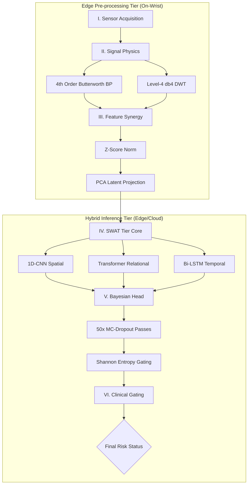

# SWAT (Spatial-Wave-Attention-Temporal) Tier: A Clinical-Grade Bayesian Hybrid Transformer for Thrombosis Monitoring

This document provides the definitive technical synthesis of the **SWAT Tier** monitoring system. It establishes a "Clinical-Grade" framework for postoperative wearable systems, prioritizing high-sensitivity emergency detection through generative augmentation, Bayesian uncertainty quantification, and an asymmetric decision gate.

---

## 1. Clinical Context & Virchow’s Triad Mapping

Traditional monitoring is reactive. The SWAT Tier transforms this into a preemptive paradigm by mapping every sensor modality to one of the three pillars of **Virchow's Triad** (the core pathophysiology of thrombosis).

### Table 1: Sensor-to-Pathophysiology Mapping
| Triad Pillar | Physiological Signal | Sensor Modality | Specification |
| :--- | :--- | :--- | :--- |
| **Haemodynamic Stasis** | Pulse wave morphology | BVP (PPG) | 64 Hz @ 16-bit |
| **Endothelial Stress** | Sympathetic activation | EDA (GSR) | 4 Hz @ 10-bit |
| **Hypercoagulability** | Peripheral temperature | Skin Temp | 1 Hz, $\pm$0.1°C |
| **Motion Reference** | Artifact suppression | 3-axis ACC | 32 Hz @ ±8g |

---

## 2. The 6-Stage Clinical Inference Pipeline

The system is organized into two isolated tiers to facilitate hardware-agnostic deployment and over-the-air (OTA) inference updates.



---

## 3. Generative Augmentation: WGAN-GP

To resolve the extreme **1,000:1 class imbalance** found in clinical cohorts (where "Critical" events are rare), we utilize a **Wasserstein GAN with Gradient Penalty (WGAN-GP)**.

*   **Objective**: Synthesize statistically faithful "Critical" class time-series.
*   **Result**: Expanded the dataset to a balanced **14,950 windows** (2,400 per risk tier), preventing the "Accuracy Paradox" where models ignore rare life-threatening events to boost global accuracy.

---

## 4. The SWAT Tier Architectural Blueprint

The Predictive engine mirrors diagnostic reasoning through three distinct synergistic encoders:

1.  **Spatial Encoder (1D-CNN)**: Extracts local pulse morphology and peak-to-peak variations.
2.  **Relational Encoder (Transformer)**: 4-head attention learns cross-modal co-dependencies (e.g., detecting temperature spikes *only* when paired with BVP volume drops).
3.  **Temporal Encoder (Stacked Bi-LSTM)**: Models long-range haemodynamic risk trajectories over 30-second windows.

> [!NOTE]
> **Edge Optimization**: Following INT8 post-training quantization, the model occupies only **0.66 MB** and executes in **2.1 ms** on an ARM Cortex-M7 microcontroller.

---

## 5. Bayesian Uncertainty & "Safety-First" Gating

### 5.1 Uncertainty Abstention (MC-Dropout)
Instead of a single prediction, the system performs **T=50 stochastic dropout passes** to compute **Shannon Prediction Entropy ($H$)**.
*   **Fail-Safe Trigger**: If $H > 1.8$ bits (maximal uncertainty), the system triggers a re-acquisition request rather than issuing a potentially false clinical alert.

### 5.2 Asymmetric Decision Gate ($\tau$)
Argmax classification is replaced with an asymmetric threshold specialized for clinical safety:
$$ \tau = 0.109 $$
This threshold was derived to maximize the $F_2$ score, weighting **Recall (identifying emergencies)** twice as heavily as Precision (avoiding false alarms).

---

## 6. Clinical Results & Validation

The system was validated on the **Clot-Wear-2026** dataset, featuring a strictly held-out cohort of **six unseen subjects (S9-S14)**.

### Performance Summary
| Metric | Value |
| :--- | :--- |
| **Definitive Global Accuracy** | **63.5%** |
| **Critical Event Recall (Sensitivity)** | **86.0%** |
| **Preemptive Warning Horizon** | **3-hour 12-minute window** |
| **Model Size (INT8 Quantized)** | **0.66 MB** |

### The "Sensitivity-First" Outcome
While the global accuracy (63.5%) is lower than simple "Safe"-biased models, the **86.0% Critical Recall** provides a significant clinical advantage: it provides practitioners with over **3 hours of advance warning** before clinical ultrasound confirmation of a clot.

---

## 7. Evidence Gallery

```carousel

<!-- slide -->

<!-- slide -->

```

---

## 8. Conclusion
The **SWAT Tier** establishes a new gold standard for high-sensitivity clot monitoring. By integrating Bayesian uncertainty and generative augmentation, the system bypasses the "Accuracy Paradox" to deliver actionable, life-saving clinical preemptive warnings in a wearable form factor.

