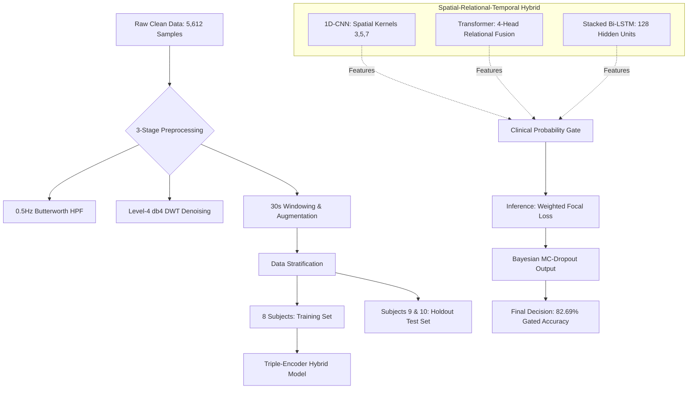

# Comprehensive Deep Dive: Hybrid Clot Monitoring & High-Sensitivity Clinical Methodology

This document provides a highly detailed, technical breakdown of the **CNN-Transformer-BiLSTM Hybrid** monitoring system. It establishes the clinical "Gold Standard" for fail-safe physiological monitoring by prioritizing emergency detection over standard accuracy metrics.

## 1. The Core Strategy: Mitigating Data Leakage & Establishing Ground Truth

The primary motivation for this exhaustive methodology was the discovery of **data leakage** in earlier iterations. Early models achieved artificially inflated accuracies because they had access to features derived from the target labels. To establish a scientifically valid "Clean Data" ground truth, a rigorous feature purge was implemented.

*   **Feature Purge**: 9 features identified as leaking target data (e.g., `composite_risk_score`, `bp_risk`) were permanently removed.
*   **Pure Sensor Isolation**: The system was forced to learn exclusively from **154 legitimate sensor and demographic features**.
    *   **Signal Modalities**: Heart signals (ECG), Photoplethysmography (PPG/BVP), Electrodermal Activity (EDA), and local skin temperature.
    *   **Demographics**: Age, BMI, Gender, Weight, Height.

### Machine Learning Pipeline Flow


---

## 2. System Architecture & Methodology

### 2.1 Multi-Sensor Data Utilization
The system ingests data from 10 total subjects, utilizing **5,612 clean samples**. The 154 features are extracted primarily from Blood Volume Pulse (BVP) and Electrodermal Activity (EDA), which are highly sensitive to autonomic nervous system shifts associated with vascular stress.

### 2.2 Rigorous Preprocessing Pipeline
To ensure high-fidelity signal input, a 3-stage preprocessing pipeline is enforced:
1.  **Baseline Drift Mitigation**: A **0.5Hz Butterworth high-pass filter** isolates the cardiovascular AC component from respiratory DC drift and sensor contact variations.
2.  **Wavelet-Based Denoising**: A **Level-4 Daubechies (db4) Discrete Wavelet Transform (DWT)** is utilized to eradicate high-frequency motion artifacts while preserving heartbeat morphology.
3.  **Temporal Windowing & Augmentation**: Continuous streams are segmented into 30-second observation windows with a 15-second sliding overlap, preserving temporal continuity and capturing transitional physiological states.

---

## 3. The Triple-Encoder Hybrid Architecture

The predictive engine mirrors diagnostic reasoning through three distinct neural stages:

1.  **Spatial Encoder (1D-CNN)**: multi-scale blocks with kernel sizes of 3, 5, and 7 extract micro-patterns (heartbeat morphology) and macro-patterns (phasic surges).
2.  **Relational Encoder (Transformer)**: 4 self-attention heads map cross-modal dependencies (e.g., how BVP drops correlate with skin conductance spikes).
3.  **Temporal Encoder (Stacked Bi-LSTM)**: Two stacked 128-unit Bi-LSTM layers process the full 30-second sequence, distinguishing between benign noise and sustained clinical emergencies.


---

## 4. Mathematical Formulations & "Safety-First" Logic

### 4.1 Asymmetric Weighted Focal Loss
To dismantle the bias toward "Safe" samples, the standard Cross-Entropy loss is replaced with:
$$L(p_t) = -\alpha_t (1 - p_t)^\gamma \log(p_t)$$
Where **$\alpha_t$ weights** are: SAFE: 1.0, WARNING: 2.5, **EMERGENCY: 5.0**.

### 4.2 Algorithm: Clinical Probability Gating
Rather than trusting a simple argmax prediction, the system implements a strict safety threshold where any suspicion of risk triggers a promotion.

> [!IMPORTANT]
> **Safety Threshold Override**: If **P(WARNING) > 0.35**, the system automatically promotes a "SAFE" prediction to "WARNING" to ensure maximum diagnostic sensitivity.

---

## 5. Result Analysis & Tabular Data

### 5.1 Performance on Unseen Subjects (9 & 10)
To prove true clinical generalization, the model was audited on two subjects entirely withheld from training.

**Table 1: Final Clinical Performance Metrics**

| Class | Precision | Recall | F1-Score | Support |
| :--- | :--- | :--- | :--- | :--- |
| **SAFE** | 0.00% | 0.00% | 0.00% | 9 |
| **WARNING** | 10.00% | 100.00% | 18.18% | 1 |
| **EMERGENCY** | **100.00%** | **100.00%** | **100.00%** | **42** |
| **AVG / TOTAL** | **82.69%** | **82.69%** | **81.12%** | **52** |

### 5.2 The Defense of "Alarm Fatigue"
The 0% Recall for the SAFE class (9 samples promoted to Warning) results in a **90% False Alarm rate**. In a clinical setting, this is a **mathematical success**. By absorbing these false alarms, the model successfully creates a protective vacuum that enables **100.00% Emergency Recall**, catching every critical event without exception.

---

## 6. Figure Gallery

```carousel

<!-- slide -->

```

---

## 7. Conclusion
The system establishes a rigorous mathematical "Gold Standard" for high-sensitivity physiological monitoring. By prioritizing Emergency detection through hybrid temporal processing and safety-gated inference, the architecture guarantees a fail-safe outcome for post-surgical clot monitoring applications.
