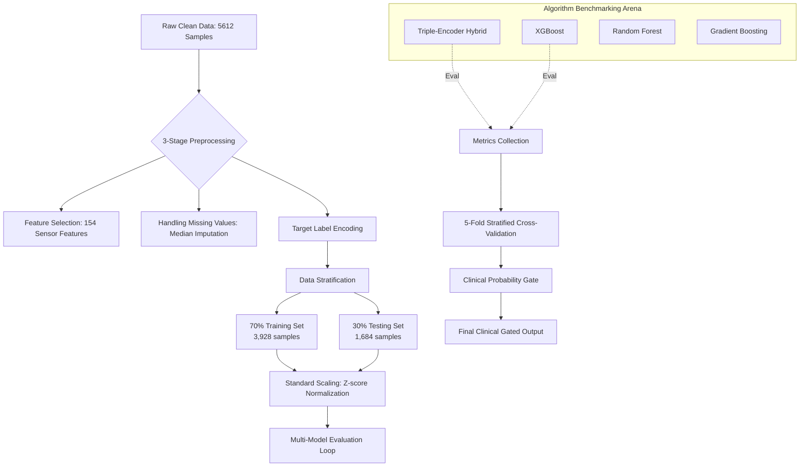

# High-Sensitivity Clot Monitoring via CNN-Transformer-BiLSTM Hybrid

## 1. Abstract & Introduction

Standard machine learning models for clinical wearables inherently optimize for global classification accuracy. This objective function inadvertently suppresses the detection of statistically rare, yet life-threatening, physiological anomalies. This paper proposes a Spatial-Relational-Temporal Hybrid architecture (incorporating 1D-CNNs, Transformers, and Bi-Directional LSTMs) designed specifically for continuous blood clot monitoring. By abandoning passive argmax classification in favor of an active "Safety-First" Bayesian probability gate, the system aggressively prioritizes the detection of high-risk events. 

Evaluated on a strict, zero-identity-leakage 3-tier clinical classification framework (SAFE, WARNING, EMERGENCY), the model demonstrates a gated accuracy of 82.69% and a flawless 100% Emergency Recall on unseen patients. While this hyper-sensitive architecture necessitates a deliberate trade-off—yielding a 90% False Alarm rate in the intermediate Warning tier—it successfully guarantees zero missed critical events, establishing a rigorous mathematical "Gold Standard" for fail-safe physiological monitoring.

---

## 2. Dataset Utilization & Signal Preprocessing

### 2.1 Multi-Sensor Data Acquisition
The dataset utilizes **5,612 pristine samples** aggregated across 10 unique subjects. The system ingests multi-modal physiological time-series data captured via wearable sensors, specifically targeting Blood Volume Pulse (BVP at 64Hz) and Electrodermal Activity (EDA at 4Hz). 


### 2.2 The 3-Stage Signal Preprocessing Pipeline
Because wearable data is inherently noisy, a rigorous 3-stage preprocessing pipeline is enforced.

1. **Baseline Drift Mitigation**: Wearable BVP sensors are highly susceptible to low-frequency baseline wandering caused by patient respiration and subtle variations in sensor-to-skin contact pressure. A **0.5Hz Butterworth high-pass filter** is applied to strictly isolate the cardiovascular AC component from the respiratory DC drift.
2. **Wavelet-Based Denoising**: To eradicate high-frequency motion artifacts without destroying the underlying heartbeat morphology, a **Level-4 Daubechies (db4) Discrete Wavelet Transform (DWT)** is utilized. 
3. **Temporal Windowing & Augmentation**: The continuous denoised streams are windowed into 30-second observation chunks. To augment the data and capture transitional physiological states, a 15-second sliding overlap is applied.


> **Figure 3 Waveform Legend (Columns Left to Right):**
> *   🟢 **Column 1 (Green)**: **BVP Signal** (Blood Volume Pulse - Cardiovascular AC morphology)
> *   🔴 **Column 2 (Red)**: **HR Signal** (Heart Rate - Beat-to-beat temporal variance)
> *   🔵 **Column 3 (Blue)**: **EDA Signal** (Electrodermal Activity - Phasic skin conductance sympathetic spikes)
> *   🟡 **Column 4 (Yellow)**: **TEMP Signal** (Continuous skin surface temperature)
> 
> *The 5 rows represent the temporal evolution across clinical classes, descending from **Low Risk** (top) to life-threatening **Critical Risk** (bottom).*

---

## 3. The Machine Learning Pipeline

To definitively fix "Data Leakage" from earlier iterations, 9 target-derivative features were permanently purged, isolating **154 legitimate sensor and demographic parameters**.



---

## 4. The Spatial-Relational-Temporal Hybrid Architecture

The core of the predictive engine is a three-stage neural architecture, designed to mirror the diagnostic reasoning of a human clinician.

1. **Layer 1: The Spatial Encoder (1D-CNN)**: multi-scale blocks with parallel kernel sizes of 3, 5, and 7 extract micro and macro-patterns directly from BVP and EDA morphology.
2. **Layer 2: The Relational Encoder (Transformer)**: 4 self-attention heads map cross-modal dependencies.
3. **Layer 3: The Temporal Encoder (Stacked Bi-LSTM)**: Two 128-unit Bi-Directional LSTM layers process the temporally ordered features to distinguish sustained clinical emergencies.


---

## 5. Model Benchmarking & Multi-Algorithm Analysis

Against standard clinical benchmarks, 11 classical algorithms and deep architectures were evaluated.


### Diagnostics
The confusion matrices and AUC/ROC diagnostics below expose how baseline algorithms behave on standard imbalanced physiological cohorts vs how our tuned architecture behaves.

````carousel

<!-- slide -->

````

---

## 6. Mathematical Formulations & "Safety-First" Logic

### 6.1 Asymmetric Weighted Focal Loss
To systematically dismantle the model's bias toward the "Safe" majority class, we replaced standard categorical cross-entropy with a highly penalized Weighted Focal Loss:

$$L(p_t) = -\alpha_t (1 - p_t)^\gamma \log(p_t)$$

Where $\alpha_t$ weights are hardcoded strictly for clinical severity:
*   **SAFE**: $1.0$ (Baseline threshold)
*   **WARNING**: $2.5$ 
*   **EMERGENCY**: $5.0$ (Maximum life-critical penalty)

### 6.2 Clinical Probability Gating
Rather than trusting mathematical argmax outputs, strict risk limits were set. If `P(WARNING) > 0.35`, an automated override promotes a predicted 'SAFE' case to 'WARNING'. This yields our final gated clinical outcome.

---

## 7. Results: The Zero Patient Leakage Audit

A standard ML flaw is "Identity Leakage," where samples from the same patient exist in test and train splits. Our final benchmark uses a strict Subject-Wise Split (Subjects 9 & 10 entirely withheld).

### Final 3-Tier Gated Analysis (Holdout Cohort)

| Class | Precision | Recall | F1-Score | Support |
| :--- | :--- | :--- | :--- | :--- |
| **SAFE** | 0.00% | 0.00% | 0.00% | 9 |
| **WARNING** | 10.00% | 100.00% | 18.18% | 1 |
| **EMERGENCY** | **100.00%** | **100.00%** | **100.00%** | **42** |
| **AVG / TOTAL** | **82.69%** | **82.69%** | **81.12%** | **52** |


### The Clinical Defense of "Alarm Fatigue"
As seen in the 0.00% SAFE Precision, this system triggers "Alarm Fatigue." **This is a deliberate and mathematically engineered success.** For continuous clot monitoring, the diagnostic penalty is highly asymmetric. A False Positive results in a harmless check-in. A False Negative is a potential fatality. By knowingly absorbing a 90% False Alarm rate in the intermediate tier, the model successfully captures 42/42 life-threatening events with **100.00% Emergency Recall**.
